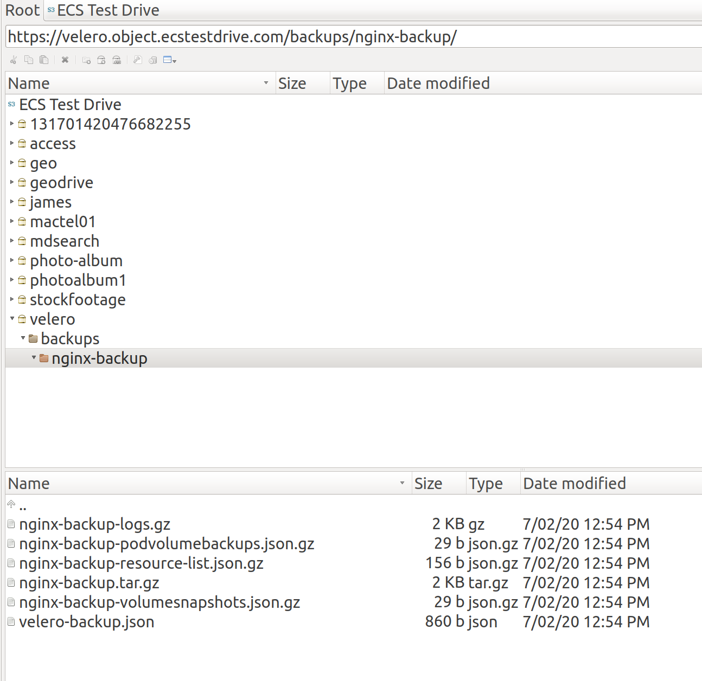

# Installation of Velero for Dell EMC ECS.

This procedure has been based on [Velero](https://velero.io/) 1.2.0 and Dell EMC ECS 3.4.

**Provider -** will be AWS (this plugin uses S3 Compatibility) this means it will work with ECS.

**Plugin -** this will deploy a container in the Velero Pod which will PUT and GET data in and out of the S3 endpoint.

**Bucket -** this will be the name of he bucket you have created for Velero.

**Secret -** this is where you will put in your ECS Access Key and Secret in the AWS CLI credentials format.

<!--You can use the AWS CLI configure command to create the credentials file which Velero will use.-->

Velero AWS Secret file syntax. These details can be extracted from the ECS GUI.

```
[default]
aws_access_key_id = <ECS_ACCESS_KEY>
aws_secret_access_key = <ECS_SECRET>
```


To install Velero use the below command replacing bucket, s3URL with your site's specific information.

For specific configuration options for backup-location-config for the AWS provider go to [this URL](https://github.com/chrisjen83/velero-ecs/blob/master/Velero%20AWS%20Plugin%20Settings.md).

> ```
> velero install \
> 
> > --provider aws \
> > --plugins velero/velero-plugin-for-aws:v1.0.0 \
> > --bucket <BUCKET_NAME> \
> > --secret-file ./credentials-velero \
> > --use-volume-snapshots=false \
> > --backup-location-config s3ForcePathStyle="true",s3Url=https://<ECS_S3_URL>
> ```

When the installation of the Velero Server in your Kubernetes cluster has been successful you should see the below results.

```
CustomResourceDefinition/backups.velero.io: attempting to create resource
CustomResourceDefinition/backups.velero.io: created
CustomResourceDefinition/backupstoragelocations.velero.io: attempting to create resource
CustomResourceDefinition/backupstoragelocations.velero.io: created
CustomResourceDefinition/deletebackuprequests.velero.io: attempting to create resource
CustomResourceDefinition/deletebackuprequests.velero.io: created
CustomResourceDefinition/downloadrequests.velero.io: attempting to create resource
CustomResourceDefinition/downloadrequests.velero.io: created
CustomResourceDefinition/podvolumebackups.velero.io: attempting to create resource
CustomResourceDefinition/podvolumebackups.velero.io: created
CustomResourceDefinition/podvolumerestores.velero.io: attempting to create resource
CustomResourceDefinition/podvolumerestores.velero.io: created
CustomResourceDefinition/resticrepositories.velero.io: attempting to create resource
CustomResourceDefinition/resticrepositories.velero.io: created
CustomResourceDefinition/restores.velero.io: attempting to create resource
CustomResourceDefinition/restores.velero.io: created
CustomResourceDefinition/schedules.velero.io: attempting to create resource
CustomResourceDefinition/schedules.velero.io: created
CustomResourceDefinition/serverstatusrequests.velero.io: attempting to create resource
CustomResourceDefinition/serverstatusrequests.velero.io: created
CustomResourceDefinition/volumesnapshotlocations.velero.io: attempting to create resource
CustomResourceDefinition/volumesnapshotlocations.velero.io: created
Waiting for resources to be ready in cluster...
Namespace/velero: attempting to create resource
Namespace/velero: created
ClusterRoleBinding/velero: attempting to create resource
ClusterRoleBinding/velero: created
ServiceAccount/velero: attempting to create resource
ServiceAccount/velero: created
Secret/cloud-credentials: attempting to create resource
Secret/cloud-credentials: created
BackupStorageLocation/default: attempting to create resource
BackupStorageLocation/default: created
Deployment/velero: attempting to create resource
Deployment/velero: created
Velero is installed! ⛵ Use 'kubectl logs deployment/velero -n velero' to view the status.
```

Now via kubectl check that the Velero Pod inside of the Velero namespace has been created and running.

```
# kubectl get pods --all-namespaces
NAMESPACE     NAME                                   READY   STATUS    RESTARTS   AGE
kube-system   coredns-584795fc57-5lmkm               1/1     Running   0          3h26m
kube-system   coredns-584795fc57-gwqkd               1/1     Running   0          3h26m
kube-system   etcd-minikube                          1/1     Running   0          3h26m
kube-system   kube-addon-manager-minikube            1/1     Running   0          3h25m
kube-system   kube-apiserver-minikube                1/1     Running   0          3h25m
kube-system   kube-controller-manager-minikube       1/1     Running   0          3h25m
kube-system   kube-proxy-fbsfh                       1/1     Running   0          3h26m
kube-system   kube-scheduler-minikube                1/1     Running   0          3h25m
kube-system   kubernetes-dashboard-d7c9687c7-kwr97   1/1     Running   0          3h26m
kube-system   logviewer-864bbcc945-6cz7b             1/1     Running   0          3h26m
kube-system   storage-provisioner                    1/1     Running   0          3h26m
velero        velero-f67877796-znf2f                 1/1     Running   0          2m16s
```

If your Velero pod is in the Running STATUS you can use the below command to verify everything is working with Velero.

```
# kubectl --namespace velero logs <VELERO_POD_NAME>
```

If anything has gone wrong in the installation then you should see it in the logs here.

Assuming there are no issues lets go ahead and create our first backup.

The below command is a simple backup job which is looking only at the application nginx which as been installed on the same Kubernetes cluster.

```
# velero backup create <BACKUP_NAME> --selector app=nginx
```

To see the progress of your backup job use the below command.

```
 # velero backup describe <BACKUP_NAME>
 
Name:         nginx-backup
Namespace:    velero
Labels:       velero.io/storage-location=default
Annotations:  <none>

Phase:  Completed

Namespaces:
  Included:  *
  Excluded:  <none>

Resources:
  Included:        *
  Excluded:        <none>
  Cluster-scoped:  auto

Label selector:  app=nginx

Storage Location:  default

Snapshot PVs:  auto

TTL:  720h0m0s

Hooks:  <none>

Backup Format Version:  1

Started:    2020-02-07 12:55:20 +1100 AEDT
Completed:  2020-02-07 12:55:23 +1100 AEDT

Expiration:  2020-03-08 12:55:20 +1100 AEDT

Persistent Volumes: <none included>
```

To see the logs of your backup you can use the below command.

```
# velero backup logs <BACKUP_NAME>
```

On Dell EMC ECS you should now see in your created bucket a folder called backup and then another folder called the backup name. Below is an example of what you should see on the ECS S3 storage.

